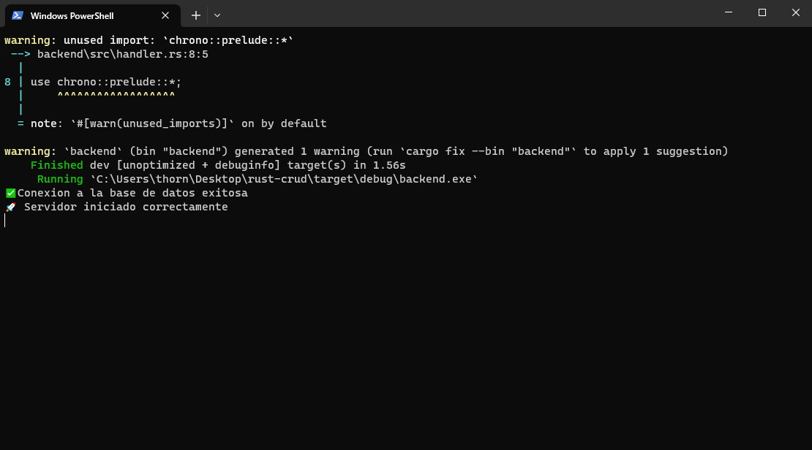
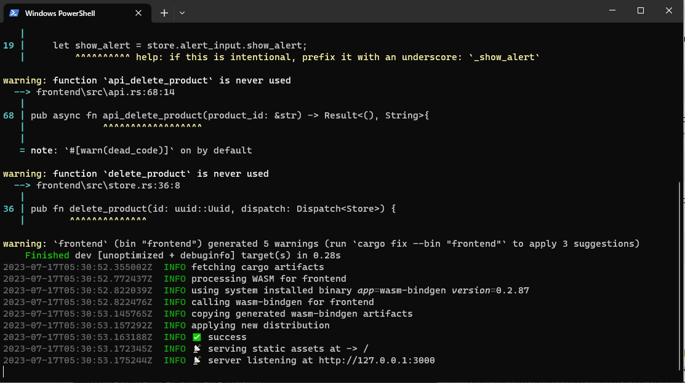
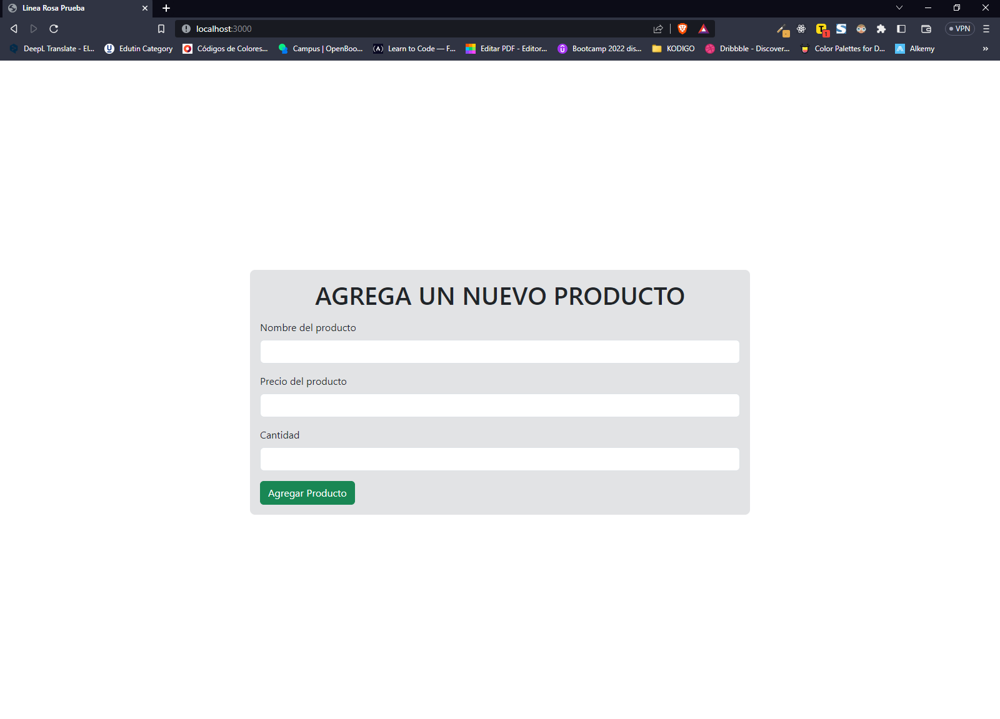
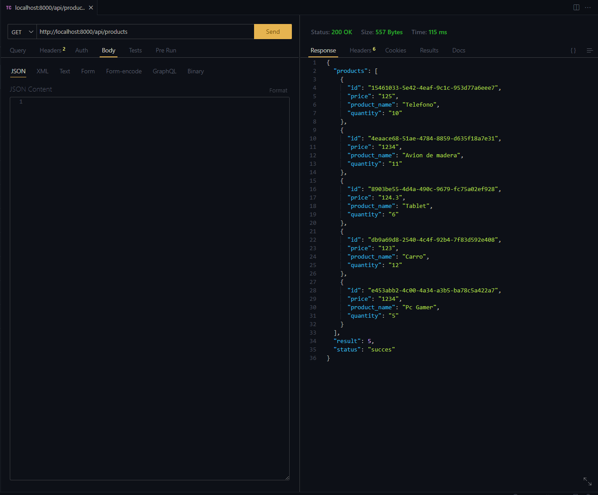
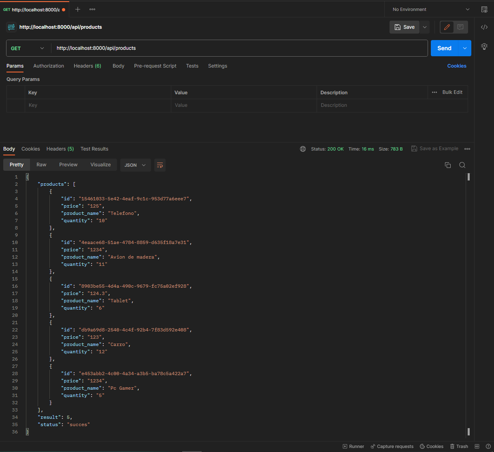
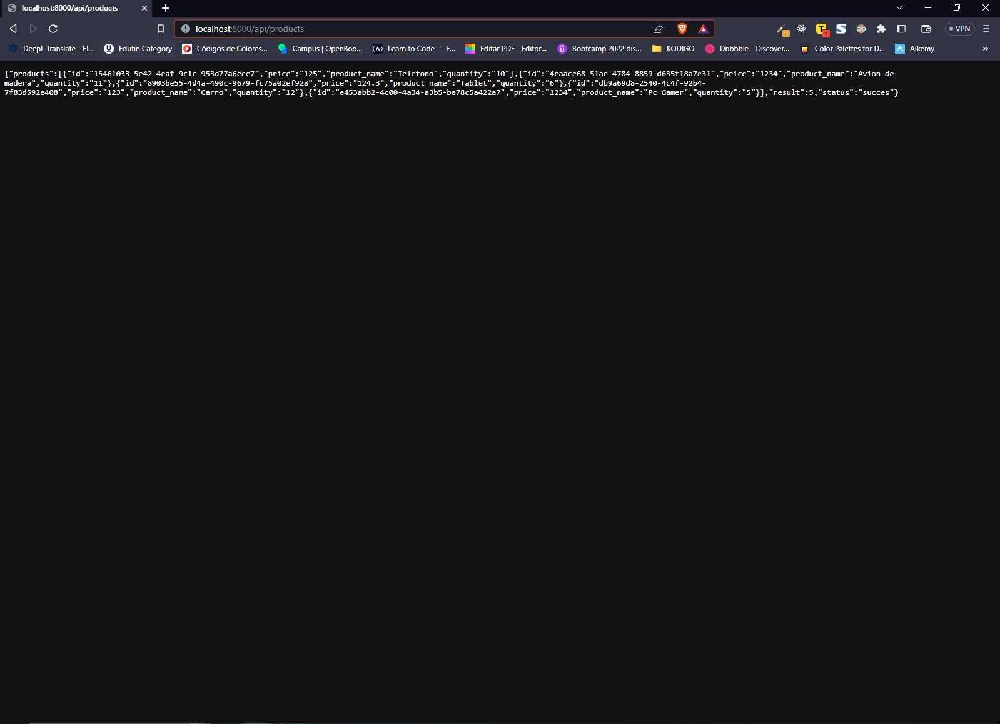

# FULL STACK CRUD CON RUST 
**Hecho con 👨🏻‍💻:**

- Rust
- Actix (Backend Rust Framework)
- Yew (Frontend Rust Framework)
- Docker
- Postgres SQL


## Usar el proyecto localmente:

### Backend

**Para poder usar el proyecto localmente es necesario descargar lo siguiente:** 
- [Rust](https://www.rust-lang.org/es/tools/install)
- [Docker](https://www.docker.com/)

Una vez instalado lo anterior, necesitaremos algunos "crates". Para eso, vamos a ejecutar los siguiente comandos:

```bash
  cargo install sqlx-cli
```
Y también:
```bash
  cargo install cargo-watch
```

Para configurar el proyecto frontend, asegúrate de que tienes Trunk y WebAssembly target instalados. Si no es así, ejecute estos comandos:

```bash
  rustup target add wasm32-unknown-unknown
```
```bash
  cargo install --locked trunk
```
Una vez instalado lo necesario, descargue o clone el proyecto de GitHub y abralo en su IDE preferido.

Para poder empezar el backend navegaremos hasta el respectivo folder de nuestro proyecto y luego ingresamos a la carpeta backend usando:
```bash
  cd backend
```
Y corremos el siguiente comando para poder levantar los contenedores en docker.
```bash
  docker-compose up -d
```
Una vez los contenedores de docker iniciados, iniciaremos la migracion de los SQL Queries a PostgresSQL utilizando el siguiente comando:
```bash
  sqlx migrate run
```
Una vez instaladas dependencias del proyecto backend podemos iniciar nuestro servidor usando el siguiente comando:
```bash
  cargo watch -q -c -w src/ -x run
```
🖼 Si todo salió correctamente se verá así:


### Frontend
Para poder iniciar nuestro proyecto de Frontend abriremos una nueva terminal (Es necesario dejar abierta la anterior para que todo funcione bien). Una vez en una nueva terminal nos dirigimos hacia la carpeta de nuestro proyecto, despues ingresamos a la carpeta "Frontend"
```bash
  cd frontend
```
Una vez en nuestra carpeta frontend vamos a iniciar el servidor del frontend usando el siguiente comando
```bash
  trunk serve --port 3000
```
🖼 Si todo salió correctamente se verá así:


Ahora abriremos el proyecto en el navegador con la siguiente dirección
```bash
  http://localhost:3000
```
Es importante abrirlo con esa URL para que la comunicación con el backend sea exitosa ✅, si lo abrimos con la URL dada por yew tendremos problemas al agregar datos.


**Nota: No pude terminar todas las funcionalidades de un CRUD como debe ser por lo que el proyecto solo agrega datos a la base de datos 😢**

Para poder ver los datos ingresados podemos hacer un get de la siguiente url.
```bash
  http://localhost:8000/api/products
```
Para poder hacer una peticion externa podemos usar:

1. Thunder Client


2. Postman


3. Desde el navegador



**Cualquier duda, consulta o feedback es bienvenido 👋🏻🔥**
## Autor

- Website - [Jonathan Larios](https://jonathanekp.github.io/Portafolio/)
- Frontend Mentor - [@JonathanEKP](https://www.frontendmentor.io/profile/JonathanEKP)
- GitHub - [JonathanEKP](https://github.com/JonathanEKP)
- Email - [Jonathan Larios](jonathanvaldez2001@gmail.com)